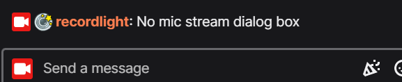
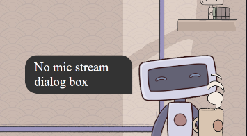
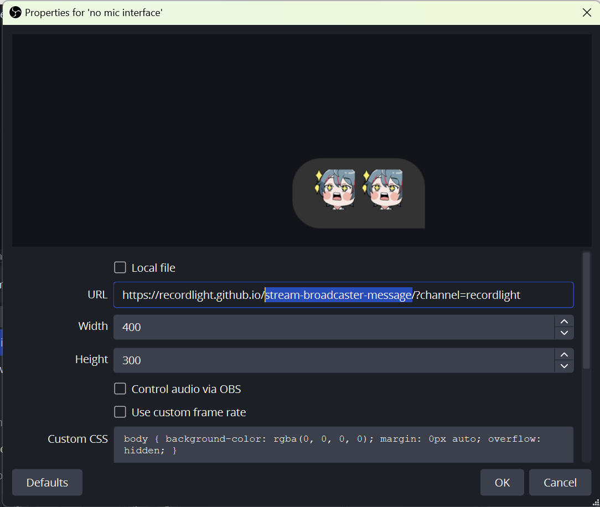
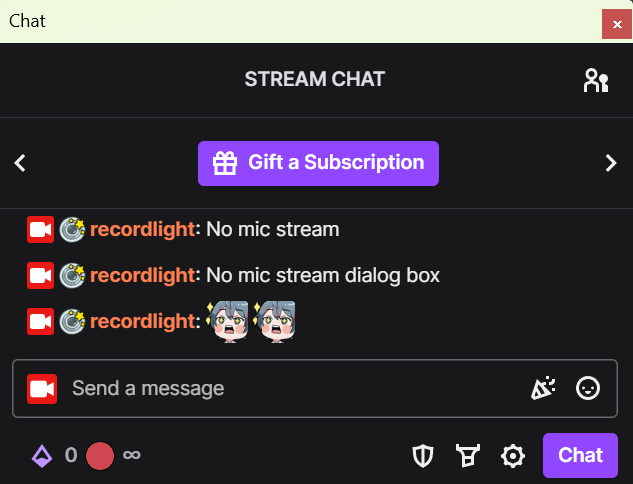
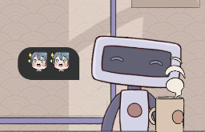

# broadcaster-dialog-box
Do you often do no mic streams? Do you perhaps wish for more engagemement? Introducing a widget to display your chat to the screen.






# Preview
Youtube video
to be uploaded...

# How to use
## Setup in OBS
Add browser source with URL: 
https://recordlight.github.io/stream-broadcaster-message/?channel=[Your channel name]

For example https://recordlight.github.io/stream-broadcaster-message/?channel=recordlight



## Chat
Type in anything in your channel chat to trigger the widget.
```
Hi hi hi
```

You can also type in 7tv and twitch emojis





# Customization
To be added

# Additional note
I would appreciate if you could put recordlight as credit (or twitch.tv/recordlight or twitter.com/recordlight_) when using the widget.

<a href="https://twitch.tv/recordlight" alt="my twitch channel">Recordlight</a>

# Change Log
| Date  | Change |
| ------------- | ------------- |
| to be updated  |  |

# Thank you